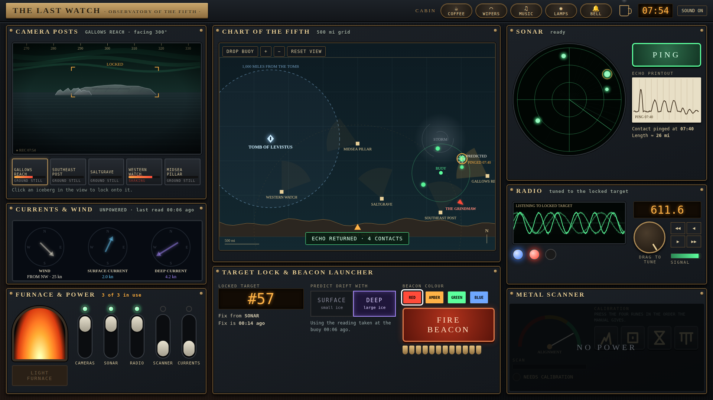

# The Last Watch



A 20-minute observatory minigame for a D&D session in Stygia. One player works the machine on stream; four players hold the Operations Manual and decode what it says. Find Elgarz, prove it, mark it with a beacon.

- **Play:** `index.html`
- **Operations Manual** (print or save as PDF for the four viewers): `manual.html`
- **GM truth view** (second tab, your screen only, passphrase `geryon`): `gm.html`
- **Design:** [docs/design.md](docs/design.md)

## Run it locally

The game uses ES modules, so it needs a local web server (opening the file directly will not work):

```sh
npx http-server -p 8080
# then open http://localhost:8080
```

Open `gm.html` in another tab of the same browser to control the session.

## Host it

Everything is static. On GitHub: Settings → Pages → deploy from a branch, choose the branch and `/ (root)`. The game appears at `https://<user>.github.io/Stygian-navigation/`.

## Checks

```sh
node tools/check.mjs
```

Verifies Elgarz's arrival time, its distance from the Tomb, the shark rule, determinism, and that a good beacon shot wins while a careless one misses.

## Tuning

All gameplay numbers are in `src/scenario.js` under `TUNING`. Add `?seed=1234` to the URL for a different arrangement of generic ice.
