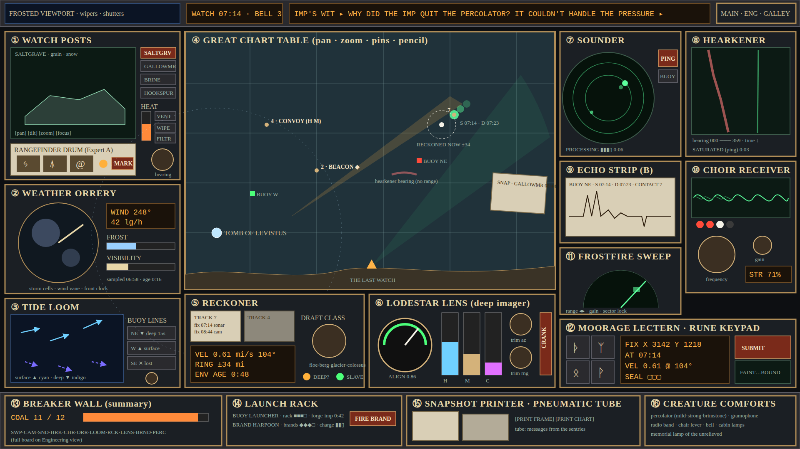

# 3. Cockpit layout, display styles and what each panel reveals



*Source: [img/cockpit-wireframe.svg](img/cockpit-wireframe.svg). This is a grey-box layout to argue about proportions and grouping. Final art will be much richer (section 8). The dashed ring around the Tomb in the wireframe is a ring the players drew themselves with the brass dividers tool; the game never draws it automatically.*

## 3.1 Three views plus focus mode [PROPOSED]

A single 16:9 screen cannot hold every control at stream-readable size. I propose three fixed camera angles of the same room, switched by a large lever on the top-right (also keys `1`, `2`, `3`). Each view keeps the Great Chart Table visible somewhere so the shared picture never disappears.

| View | Holds | Why it is separate |
|---|---|---|
| **Main Console** (pictured) | Observation, tracking, scanning, lock | Where 80% of play happens |
| **Engineering Wall** (left turn) | Furnace and boiler, full Breaker Wall, Valve and Fuse Board, Boiler Governor, Buoy Rack and winch, Brand harpoon loading, repair sled dispatch | Repairs and power feel physical and "over there"; a hazard alarm sends the operator here, which itself is a moment of drama |
| **Galley and Gallery** (right turn) | Percolator, gramophone and radio band, chair lever, cabin lamps, bell rope, memorial lamp, pneumatic tube rack, shutters | The jokes and the melancholy live together; nothing here is required |

**Focus mode:** clicking a panel's brass nameplate zooms it to ~70% of the screen with large text, while every other panel on that view continues running as a dimmed miniature around the edges. Live readouts in miniature keep moving, so nothing is "paused" by inspecting something. `Esc` or clicking the frame returns.

**Persistent miniatures:** a thin strip at the top (always visible in every view) holds the watch clock, the Imp's Wit ticker, the coal gauge, and three alarm lamps (Post Heat, Sounder Threat, Boiler). The Watchkeeper can watch this strip on any view.

## 3.2 Main Console panels

Numbers match the wireframe.

| # | Panel | Display style | Controls | Reveals | Zoomable |
|---|---|---|---|---|---|
| 1 | **Watch Posts** (remote cameras) | Grainy monochrome raster CRT with scanlines, snow, and frost creep at the edges | 4 post selector tabs; pan/tilt/zoom/focus knobs; FILTER rotary (clear, frostglass, ember); WIPE pull; VENT tab; MARK button; bearing knob | Live silhouettes of ice in that post's field: shape, size, surface marks (rust bloom, straight shadows, organic ridges, inhabited lights). Heat thermometer of the active post. MARK freezes a Rangefinder Drum reading (three glyph wheels, a lamp colour and a needle) that Expert A converts to bearing, length class and range band | Yes |
| 2 | **Weather Orrery** | Brass orrery disc with translucent storm discs drifting on wires; nixie wind readout; frost and visibility bars | Power switch; "PROJECT" toggle (forecast storm motion 2 minutes ahead); post-select knob for which station's wind to read | Wind direction and speed at a chosen station, storm cells and their drift, frost level (affects echo reading), visibility at each post. Every reading has a **sampled** time and an **age** counter | Yes |
| 3 | **Tide Loom** | Indigo glass with woven thread-arrows. Surface layer cyan, deep layer violet dashed | Buoy line switches (raise/lower per buoy: lowering takes 15 s of chain rattle); interpolation knob (nearest vs smooth) | Surface and deep current vectors at each sounding buoy and an interpolated field between them. Each arrow fades as its sample ages | Yes |
| 4 | **Great Chart Table** | Engraved brass-and-slate chart, pan/zoom. Overlays: sweep blooms (green wash), sonar afterglow dots (phosphor, fading), camera fans (amber), Hearkener bearing lines (red, no range), Reckoner ghosts (white dashed rings), pins, pencil lines, snapshot slips, beacons (gold diamonds) | Drag to pan, wheel to zoom; tool tray: PIN, PENCIL, ERASER, DIVIDERS (draws measured circles), SLIP (attach snapshot), RULER (distance and bearing) | The accumulated picture. Everything the instruments report lands here with sample time; everything the players author stays until erased | Fullscreen chart mode |
| 5 | **Reckoner** | Paper track cards in a brass rack; amber nixie readout; draft class rotary; lamps | Drag fixes from the chart onto a card; DRAFT CLASS knob; SLAVE toggle (feed Lens); CLEAR card | Estimated velocity and present position of a track, uncertainty ring, age of environment inputs. Lamp **DEEP?** lights when the fitted velocity disagrees with the surface-current prediction for the chosen draft class, hinting "this one rides the deep current" | Yes |
| 6 | **Lodestar Lens** (deep imager) | Big brass dial with green arc alignment needle; three glass vials (H, M, C) that fill with coloured light; a crank to raise the lens | POWER; CRANK (spin-up); trim azimuth and range knobs; channel shutters H/M/C; CALIBRATE (opens the Lens Litany keypad overlay) | Alignment quality right now (honest). Evidence accumulation per channel. On channel completion, prints an artefact for interpretation: a **cavity tomograph** slice (B), a **lodestone rosette** (A), a **choir triad** sequence (A plus B) | Yes |
| 7 | **Sounder** | Circular phosphor PPI with rotating trace and afterglow | Buoy selector; PING; range ring knob; PROCESSING lamp bar | Contacts within the active buoy's radius as dots at their **sampled** positions, after a processing delay. Dot size ∝ estimated draft. Each dot also projects to the chart | Yes |
| 8 | **Hearkener** | Waterfall display, bearing across, time downward | Gain; hydrophone selector (observatory, or any buoy with a hydrophone); LISTEN headphones toggle (routes to speakers) | Bearing-only tracks of noisy things: grinding ice, the leviathan's low band, remorhaz burrowing tremors near posts, the Tolling Berg's ring. Saturates for ~6 s after any ping | Yes |
| 9 | **Echo Strip** | Paper strip printer chattering out a trace | Feed knob (to scroll back); TEAR (tear off strip and pin it to chart) | Echo waveform per contact. Expert B reads it against frost band and contact draft for density, cavity, interior edges | Yes |
| 10 | **Choir Receiver** | Oscilloscope with up to three stacked waves; four lamps; big bakelite frequency dial; gain; strength nixie | Frequency dial (coarse/fine by drag speed); gain; DIRECTION wheel (antenna bearing); MUTE | Bearing and frequency of resonant sources by hill-climbing to peak strength. When peaked on a source with resonance, the lamps flash its triad pattern and the speaker plays a chord | Yes |
| 11 | **Frostfire Sweep** | Half-moon scope with slow rotating arm; green blooms | Range (near/mid/far); gain; SECTOR LOCK (sweep a 60° sector faster) | Coarse "mass blooms" in range-bearing cells, intensity ∝ mass. Finds things, identifies nothing | Yes |
| 12 | **Moorage Lectern** with **Rune Keypad** | Iron lectern with four rune keys, nixie solution register, SUBMIT lever, four-lamp strength scale | Load from track card; nudge fields; SUBMIT; rune keys | Graded response to a moving solution (Faint, Warm, Strong, Bound). Hosts the Anchorage Litany once Bound | Yes |
| 13 | **Breaker Wall** (summary) | Coal gauge and per-system tiny lamps | Clicking jumps to Engineering view | Total load vs capacity | No |
| 14 | **Launch Rack** | Rack slots and charge bars | Buoy launch aim (drag on chart), FIRE BUOY; FIRE BRAND (needs a pinned target and a scan result) | Stock of buoys and brands; forge-imp rebuild timer | Yes |
| 15 | **Snapshot Printer and Pneumatic Tube** | Paper slips | PRINT FRAME (current camera), PRINT CHART (region), tube canister | Timestamped evidence slips. The tube sometimes delivers notes from absent sentries (flavour, occasional gentle hints the GM can trigger) | Yes |
| 16 | **Creature Comforts** (Galley view) | Various | Various | Atmosphere, jokes, small real effects (section 4.6) | Yes |

## 3.3 Engineering Wall [PROPOSED]

```
┌──────────────────────────────────────────────────────────────────────────────┐
│  FURNACE                 │  BREAKER WALL (12 to 14 coal)                     │
│  ┌───────────┐  STOKE ▲  │  [SWP 3][CAM 2][SND 3][HRK 1][CHR 2][ORR 1]       │
│  │  door     │  DAMPER ◐ │  [LOOM 1+][RCK 2][LENS 5][BRND 2][PRNT ½][PERC 1] │
│  │  flames   │  temp ▮▮▯ │  each: breaker, spin-up lamp, % needle            │
│  └───────────┘           │                                                   │
│  BOILER GOVERNOR (needy)  │  VALVE & FUSE BOARD (repairs, Expert B)          │
│  3 pressure gauges        │  6 sockets, 4 valves, 1 sled-dispatch handle     │
│  3 valve wheels           │  damaged-system lamp cluster                     │
├──────────────────────────────────────────────────────────────────────────────┤
│  BUOY RACK & WINCH: 4 slots · forge-imp anvil (builds one buoy every 90 s)    │
│  BRAND RACK: 4 brands · loading crank · retaliation warning bell             │
└──────────────────────────────────────────────────────────────────────────────┘
```

## 3.4 Galley and Gallery [PROPOSED]

```
┌───────────────────────────────────────────────────────────────────────┐
│ PERCOLATOR (3 strengths)   GRAMOPHONE + RADIO BAND (adjacent switches)  │
│ CHAIR LEVER (height)       CABIN LAMPS (3 tones)    SHUTTERS (crank)    │
│ BELL ROPE                  MEMORIAL LAMP OF THE UNRELIEVED              │
│ PNEUMATIC TUBE RACK (old canisters, some readable)                      │
│ ROLL OF THE WATCH (names of sentries, lit when the memorial lamp burns) │
└───────────────────────────────────────────────────────────────────────┘
```

## 3.5 Readability rules for a streamed screen [HARD intent, PROPOSED specifics]

- Minimum rendered text height 18 px at 1080p for anything the operator must read aloud; 14 px for decorative engraving.
- Every display uses at most three hues plus its background. Hue meanings are global: green = live measurement, amber = operator-authored or decoded, white = prediction, red = threat, violet = deep or resonant.
- Every alarm is both a colour change and a shape or motion change (for colour-blind players and compressed streams).
- Phosphor afterglow fades over several seconds with no sub-second flicker (streams compress flicker into mush and it can bother photosensitive viewers).
- Glyphs on keypads and drums are large (≥ 40 px) and drawn with distinct silhouettes so they can be described in words ("the hook with two dots").
