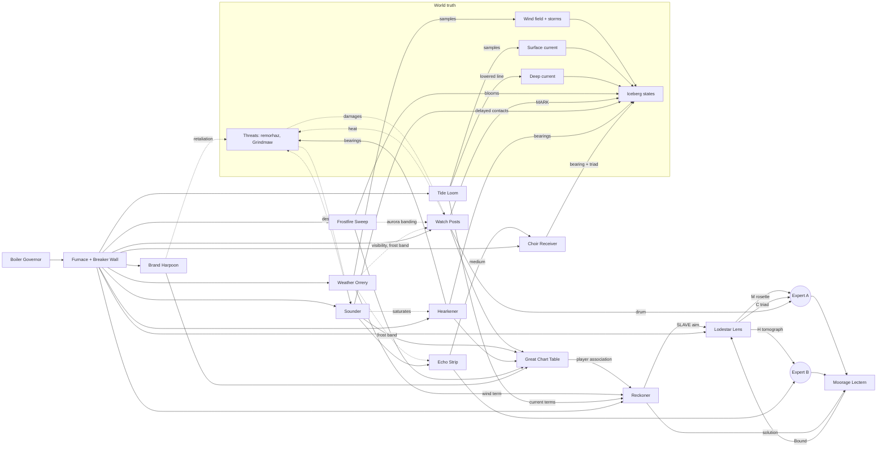

# 4. Interdependency graph and power allocation

## 4.1 Interaction matrix [PROPOSED]

"Samples at" means the world time the measurement represents. "Delivers" means when the players see it. Power is in **coal** (see 4.3).

| Instrument | Measures | Samples at | Delivers | Power | Interferes with | Enables / improves |
|---|---|---|---|---|---|---|
| **Frostfire Sweep** | Mass bloom per range-bearing cell (bearing 6°, range 150 mi, intensity ∝ mass) | When the arm passes the cell | Same instant; fades 40 s | 3 | Camera posts in the swept sector get aurora banding (visibility −30%) | Finding; choosing where to aim buoys and posts |
| **Watch Post** (one active) | Silhouette, surface features, MARK drum (bearing ±1°, length class, range band) | MARK press | Instant (drum); decoding is human | 2 (+½ per WIPE) | Heats post (remorhaz); a hot post's vent plume reduces its own visibility briefly | Fixes; Worked metal *hint* via ember filter; draft class guess from length |
| **Sounder** (active ping) | Contacts in buoy radius 450 mi: position ±15 mi, draft ±20%, echo trace | Ping instant | +9 s processing, +2 s per 100 mi of contact distance from buoy | 3 (only while pinging, 5 s) | Hearkener saturated 6 s; raises local **noise** at that buoy (leviathan) | Fixes; Echo Strip (hollow evidence and medium for Choir) |
| **Hearkener** (passive) | Bearings of loud sources ±6° from the chosen hydrophone | Continuous | Continuous waterfall | 1 | Saturated by pings | Cross-bearings from two hydrophones = fix with no noise; threat monitoring |
| **Choir Receiver** | Bearing ±2° at peak; frequency; triad pattern | Continuous | Continuous | 2 | Gramophone in RADIO mode bleeds music into it | Resonance evidence; Seal glyph; a way to find Elgarz before it is visible |
| **Weather Orrery** | Wind vector at chosen station; storm cell positions and drift; frost band; post visibility | Refresh every 20 s while powered | Instant per refresh; ages when off | 1 | None | Reckoner wind term; Echo Strip interpretation (frost band); post choice |
| **Tide Loom** | Surface current at every live buoy; deep current at buoys with lowered lines | Refresh every 20 s while powered | Instant per refresh; ages when off | 1 + ¼ per lowered line | Lowered line makes that buoy slower to recover (it cannot be reeled in quickly) | Reckoner current terms; the DEEP? clue |
| **Reckoner** | Fits velocity from associated fixes; propagates with environment model | On demand and every second | Instant | 2 | None | Ghost and ring on chart; Lens auto-aim (SLAVE) |
| **Lodestar Lens** | Alignment (honest); evidence H, M, C | Continuous while aligned | Artefact printed per channel when full | 5 (+15 s spin-up) | Draws so much that something else must go off | Identification; final anchorage reward; auto-hold once lock is Bound |
| **Brand Harpoon** | None (actuator) | Fire instant | Brand lands after flight time (≈ distance / 120 mi s⁻¹) | 2 while charging (10 s) | Living bergs may retaliate | Permanent live position for a tagged berg |
| **Moorage Lectern** | Compares a submitted solution to Elgarz's truth | Submit | Instant graded lamp | 0 | None | Lock; anchorage litany |
| **Snapshot Printer** | Copies a panel's current image with time | Press | 3 s | ½ while printing | None | Persistent evidence |
| **Percolator** | Coffee | Brewing 30 s | | 1 while brewing | Steam fogs the Frosted Viewport (wipers clear it) | Operator happiness; a rare joke |
| **Gramophone/Radio** | Music | | | 0 (spring-wound) or ½ (radio) | Radio mode bleeds into Choir Receiver | Atmosphere |

**No decorative gauges rule:** every needle on the Main Console is backed by a simulation value listed above. Ambient-only dials live in the Galley.

## 4.2 Dependency graph

Solid arrows carry information. Dotted arrows are side effects and interference.

### Wind, current, Reckoner, Lens relationships (explicit)

1. Wind and both current layers **move every berg** in the truth simulation, weighted by that berg's draft class (section 5.2).
2. The Orrery and Loom produce **samples** of those fields, each with a sample time. When unpowered they keep their last sample and an age counter that keeps climbing.
3. The Reckoner predicts a track's present position by combining (a) the fitted velocity from player-associated fixes and (b) the environment-model velocity computed from the latest samples and the player-chosen draft class. The blend weight and the ring size depend on fix count, fix age, and environment age.
4. The Lens, when SLAVED, aims at the Reckoner's prediction. The *true* alignment is the distance between that aim point and the berg's true position compared to the beam radius. A stale or wrong model makes the aim drift away from truth during the scan. The operator sees this immediately on the honest alignment needle and can trim manually, re-observe, or power the Orrery/Loom back up to refresh.
5. Therefore ignoring weather and currents gives a lens that drifts off a large glacier after ~20 to 40 s; using fresh deep-current data holds it for several minutes.

## 4.3 Power, heat and capacity [PROPOSED, all numbers TUNE]

**Coal** is the unit. The furnace provides **12 coal** of capacity. It is a ceiling on simultaneous draw. Coal never runs out.

| Control | Effect |
|---|---|
| **STOKE** lever | +2 capacity (14) for 60 s, then the furnace needs 45 s at ≤ 10 draw to cool (the damper lamp shows this). Fully recoverable |
| **DAMPER** | Lowering capacity to 10 makes the furnace quiet (the Hearkener's own-noise floor drops, giving cleaner bearings). A rare, clever trade |
| **Overdraw** | If draw exceeds capacity, the newest-powered system's breaker trips with a bang. Nothing breaks |
| **Spin-up** | Lens 15 s, Sweep 5 s, Choir 3 s, others ~1 s. Spin-up draws full power |
| **Retained data** | Orrery, Loom, Reckoner cards, Echo strips, chart marks, and drum readings all persist when unpowered. Live views (camera, sweep, Hearkener waterfall) go dark |

### Sample loads

| Situation | Load |
|---|---|
| Searching: Sweep 3 + Camera 2 + Hearkener 1 + Choir 2 + Orrery 1 + Loom 1 | 10 |
| Fixing: Camera 2 + Sounder ping 3 + Hearkener 1 + Orrery 1 + Loom 1 + Reckoner 2 | 10 |
| Scanning: Lens 5 + Reckoner 2 + Choir 2 (needed for C channel) + Loom 1 + Orrery 1 | 11 |
| Scanning while watching a post: add Camera 2 | 13 → needs STOKE or drop Choir |

The scanning case is the core trade-off: Choir on means the resonance channel fills; Orrery and Loom on mean the tracking stays honest; a camera on means you can watch a remorhaz approach. You cannot have all of them without stoking, and stoking has a cool-down.

### Camera post heat

Each post has heat `h ∈ [0, 100]`.
- Active: `h += 1.2/s` (+0.6 per WIPE, +2 instantly per DEFROST pulse).
- Inactive: `h -= 0.8/s`. VENT tab: `h -= 25` instantly but puts a steam plume on that camera for 8 s.
- Heat bloom radius (how far remorhazes can sense the post) = `40 + 3·h` miles.
- Thresholds: 50 orange lamp, 75 red lamp, alarm bell.

### Avoiding one-operator overload [HARD intent]

- No control requires a click within a time window shorter than ~8 s after a warning appears.
- Every threat announces itself at least 45 s before contact on two different displays.
- Alignment uses **slow** target drift and a SLAVE mode, so trimming is calm hill-climbing.
- The Boiler Governor (needy) pauses its timer whenever the Lens is mid-scan above 0.7 alignment, so two demands never peak together. This is invisible to players and keeps the session humane.

## 4.4 Incidental controls with real but optional effects

| Control | Effect | Joke or charm |
|---|---|---|
| Percolator (mild/strong/brimstone) | 1 coal for 30 s; steam fogs the Frosted Viewport | Brimstone strength makes the Imp's Wit ticker speed up for a minute |
| Gramophone (spring wound) | Plays one of four records; adjacent RADIO switch tunes old infernal broadcast bands (½ coal) | Radio bleeds into Choir Receiver as a fourth, obviously-wrong tone (a lesson about interference) |
| Windshield wipers | Clear the Frosted Viewport, which shows the local sky; storms reaching the observatory itself are visible here first | Wipers on max during a blizzard make a satisfying thunk-thunk |
| Chair lever | Raises the camera framing of the whole room 4% (purely cosmetic) | Lowest setting: operator's eye line is at the percolator |
| Bell rope | Rings a deep bell. Remorhazes within 60 mi of any post pause for 5 s (real, tiny, never mentioned) | The bell echoes on the Hearkener |
| Cabin lamps (three tones) | Changes room lighting; red mode improves CRT contrast slightly | |
| Shutters | Close over the Frosted Viewport; closed shutters make the room 1° warmer on the furnace gauge | |
| Memorial lamp | ½ coal. While lit, the Imp's Wit ticker shows the names of sentries who were never relieved instead of jokes | The melancholy note of the room |
| Pneumatic tube | Occasionally delivers canisters: old duty rosters, a recipe, or a GM-triggered hint | |
| Imp's Wit ticker | Dad jokes. Clicking the ticker makes the imp groan and tell another | Never carries required info |

## 4.5 Alternate designs considered

| Alternative | Pros | Cons | Recommendation |
|---|---|---|---|
| **Patch-cord switchboard** instead of breakers (route 6 trunk lines among systems) | Very tactile; looks great on stream | More clicks per change; slower to read at a glance | Use for the *Valve & Fuse Board* repair module only |
| **Percent power sliders** (Signal Simulator style) | Fine-grained trade-offs; performance scales with power | Encourages fiddly micro-optimisation by one operator | Keep binary breakers for most systems; allow the Lens a 3-step power dial (slow, normal, overdrive) |
| **Heat as the main resource** (EmptyEpsilon-style coolant budget) | Elegant | Doubles the resource model players must learn | Keep heat local to camera posts and the furnace stoke |
| **No Reckoner; players dead-reckon by hand** | Purest investigation | Too much arithmetic for a 25-minute D&D side game | Keep the Reckoner, but let the Plotter beat it with a good pencil solution (the Lectern accepts any solution) |
